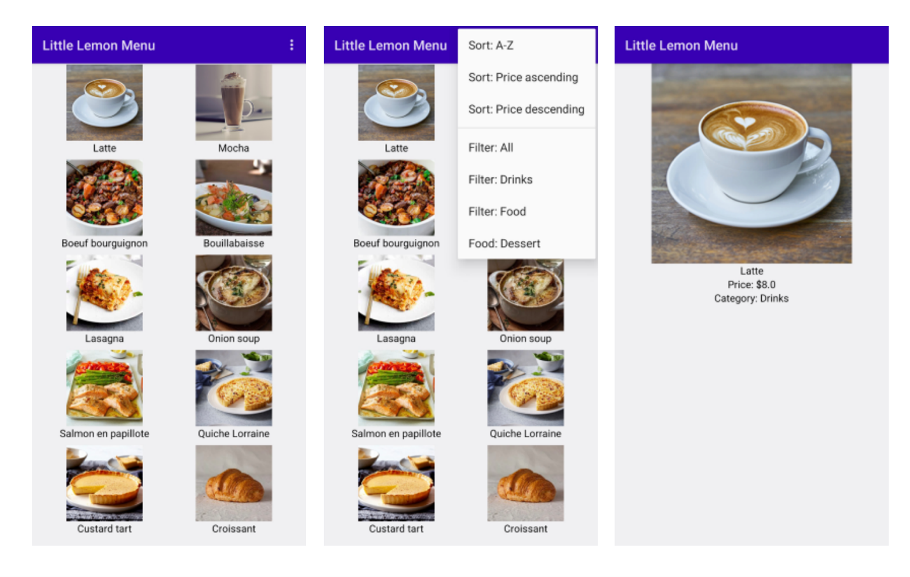

# Little Lemon dinner menu
The advanced programming in Kotlin course has taught you several unique components of Kotlin, 
as well as widely adopted programming techniques that enable the building of robust Android apps. 
In the final project, you are going to use most of these components 
and techniques to add core functionality to an existing app. 
These will include singleton objects, companion objects with constant values 
and extension functions including those used for collection processing 
and unit testing.

## The project outline
The Little Lemon restaurant has built a menu application for its customers. 
It has a list of all the products provided by their main branch. 
Currently, customers can only browse the list, but can’t sort, search or filter it. 
Therefore, there’s considerable room to improve the user experience. 
Little Lemon wants you to implement these features in the existing app. 
The user interface for the app is already built, 
you now have to provide the implementation for sorting, 
searching and filtering products, as well as opening the product details screen.


## Task 1
Currently, a list of products is declared inside the `onCreate` function of `MainActivity.kt`, 
however, it may be used from any part of the app. Your task is to:

- create a singleton object `ProductsWarehouse.kt`
- move the list declaration from `onCreate` to `ProductsWarehouse.kt`
- update the usage of `productsList`

When a user clicks on a product image the app should open a new activity with its details. 
The activity and UI are already implemented in the `ProductActivity.kt` file.

## Task 2
Add implementation of the function `startProductActivity`.

In the function body:
- declare an `Intent` variable
- pass the context and `ProductActivity::class.java` in the right side of the declaration, 
  (the `Intent` *constructor*)
- execute the `startActivity` function and pass the created intent variable to it

## Task 3

Right now, `startProductActivity` implementation is not complete, 
as it doesn't pass the selected product details to the `ProductActivity.kt`. 
For this, you need to take several steps:
- declare a companion object inside the `ProductActivity` 
  (in the bottom of the class, just before the last closing curly braces)
- add four constant values for product title, price and image
    ```kotlin
    companion object {
        const val KEY_TITLE = "title"
        const val KEY_PRICE = "price"
        const val KEY_IMAGE = "image"
        const val KEY_CATEGORY = "category"
    }
    ```
    
- add fields from the product object to the `intent` as extra properties
  using the `putExtra` method of `Intent` (use newly created constant values as keys)

## Task 4
The `startProductActivity` function is ready, however, the function is not executed on image click.
To execute this function on an image click follow these three steps:
- add a second parameter named `startProductActivity` in the `ProductsGrid` function declaration. 
  It should be a function as an object with function type of `(ProductItem) -> Unit`
- in the `Modifier.clickable` body, execute this function and pass the `ProductItem` variable
- finally, in `onCreate` pass the function as an object (`this::startProductActivity`) 
  to `ProductsGrid` execution

## Task 5
The only thing left is to get the passed parameters in `ProductActivity.kt` 
and display product details:
- declare `title` variable with the value from `intent` using `getStringExtra` 
  and passing the constant value `KEY_TITLE` from `ProductActivity` 
  (`intent` is already present in `ProductActivity.kt`)
- declare a `price` variable. Get its value from `intent` using `getDoubleExtra` 
  and passing the `KEY_PRICE` constant
- in a similar manner, declare the `category` and `image` variables.
  Initialize them using `intent` and its `getStringExtra` and `getIntExtra` functions
- create a `productItem` variable of type `ProductItem`.
  Pass the title, price, category and image to its constructor
- pass the `productItem` variable to the `ProductDetails` composable function 
  that is already called inside `setContent`

## Task 6
Now, as the main features of the browsing products list and product details are ready,
you can switch to the extra features. Let’s start with filtering.
Showing filtering options and handling clicks are already implemented, 
you just  need to write the filtering logic:
- Open `FilterHelper` class
- Replace "TODO" with actual logic of filtering `productsList`: on `productsList` 
  execute filter function with product category equal to selected

## Task 7
Similarly, sorting interaction is implemented 
and only the logic for sorting based on price is missing.
- Open `SortHelper`
- Add extension function for `List<ProductItem>` named for sorting based on price ascending
- Replace "TODO" for `SortType.PriceAsc` to this extension function call
- Add extension function for `List<ProductItem>` named for sorting based on price descending
- Replace "TODO" for `SortType.PriceAsc` to this extension function call

## Task 8
Write a unit test for `FilterHelper.filterProducts`:
- Create a unit test class `FilterHelperTest`
- Create a test function `filterProducts_filterTypeDessert_croissantReturned`
- Declare a variable list with several items of different categories 
    ```kotlin
    val sampleProductsList = mutableListOf(
    		ProductItem(title = "Black tea", price = 3.00, category = "Drinks", R.drawable.black_tea),
    		ProductItem(title = "Croissant", price = 7.00, category = "Dessert", R.drawable.croissant),
    		ProductItem(title = "Bouillabaisse", price = 20.00, category = "Food", R.drawable.bouillabaisse)
    )
    ```
    
- Execute `FilterHelper.filterProducts` and pass `Dessert` as `FilterType` and `sampleProductsList`
- Test the result, expect the result to contain only **croissant**.