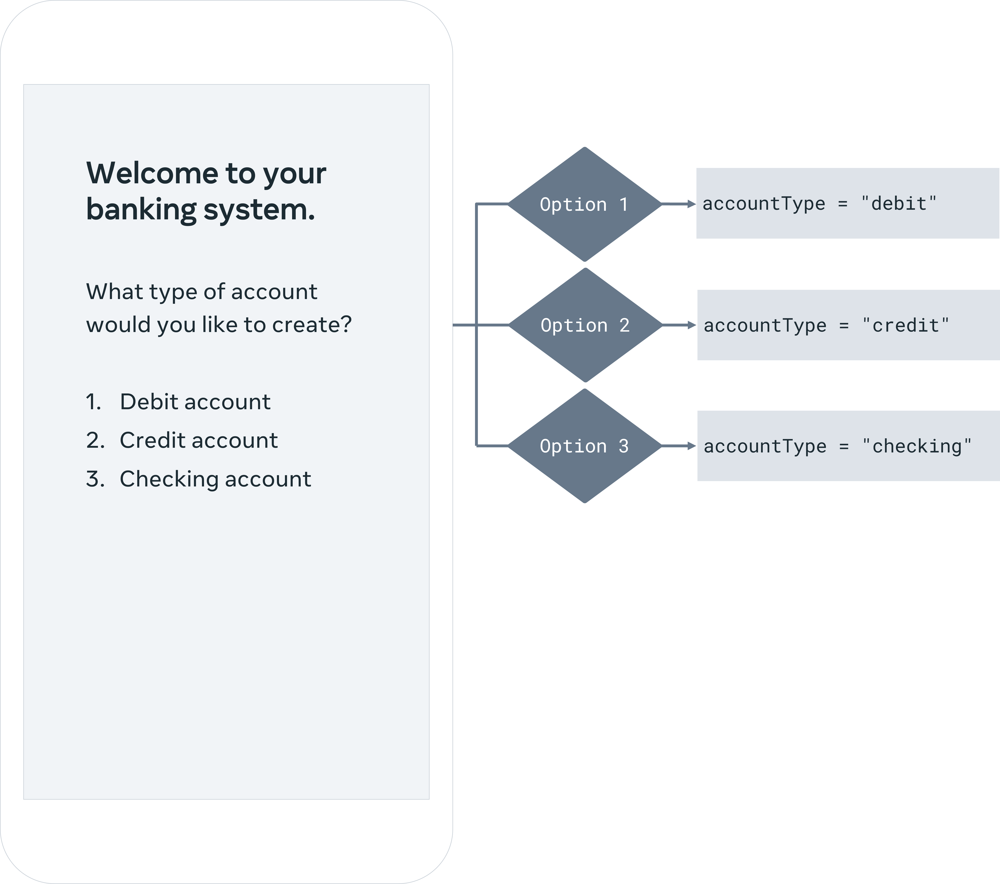

## Overview
In Part 1 of the project, you will practice working with print statements, loops and 
`when` expressions to create the bank account project. 
For different bank account types, you will define a sealed class with its respective class hierarchies.

The logic for the  code looks like this:


This is an example of the output produced from your fully completed part one code:


## Scenario
In this project, you are creating a simulation of an online bank account system. 
The system will support 3 different bank account types.
The bank account type can be a Debit Account, a Credit Account or a Checking Account. 
You will use print statements to create the visual interface and 
then use loops and when statements to process the simulated user input and implement the bank account app’s operations.

## Instructions
Once you have created a new project, follow the steps below to begin creating your banking system app.

**Tip:** *Use a `while` loop to create the bank account based on the user’s choice.*

**Tip:** *Use `when` expressions to select the right bank account type from the list of bank account types provided by the bank app user interface.*

### Step 1: Start the bank system interface
First, you need to create the user interface for the bank account app. 
This interface will guide users through the bank account setup process.

To achieve this, use print statements to display the following on the interface:
```
Welcome to your banking system.
What type of account would you like to create?

Debit account
Credit account
Checking account
```
**Note:** Use 6 different print statements to display the welcome message and the 3 different account options.

### Step 2: Create variables for the bank account type and user input
Next, create variables that will be used to store the bank account’s type and the user’s input. 
1. Create a variable for the bank account’s type. 
Call it `accountType` and set its value to "" (which is an empty string.)
2. Create a variable for the user’s input. Name it `userChoice` and set its value to 0 (Zero).

### Step 3: Create a bank account based on user input
In this step, you will create the bank account and set its type based on the user’s input.

**Note:** By default, the Playgrounds environment can’t process user input. 
Here you will bypass that problem by generating random numbers that are used to simulate a user’s input.

You will start by defining a `while` loop that generates user input using random numbers. 
If the numbers generated are either 1, 2, or 3, the bank account will be created. 
The loop should repeat itself as long as the value of the `accountType` variable is equal to an **empty string**. 
If the generated user input is valid the first time the loop runs, the loop will conclude. 
If the generated input is invalid, the loop will repeat until the generated user input is valid.

Don't worry if this sounds complicated, the steps below will guide you through the process.

#### Generating user input in the while loop
1. After inserting the keyword `while` for the while loop, in parentheses add the conditional statement `accountType == ""`. 
Then, include a print statement inside the curly braces to display the options for the different account types. 
The print statement should print: 
```Choose an option (1, 2 or 3)```

2. Next, to simulate the user input use `IntRange.random()` function to generate a random number between 1 and 5. 
To do so, use it as `(1..5).random()` wherein 1 is the lower and 5 is the upper bound of the generated random numbers. 
Assign the generated random number to the `userChoice` variable.
**Note:** Valid choices are between 1 and 3. 
You are generating random numbers between 1 and 5 so that the range accommodates two invalid user choices (4 and 5) – 
simulating the mistypes that sometimes happen in a real-world scenario.

3. Inside the while loop, print the generated random number to the console. 
This is the simulated user input. Your print statement should display:
```The selected option is...```

**Note:** Use string interpolation to access the value of the `userChoice` variable inside the print statement.

#### Defining the account type based on user input
Next, you will declare a `when` expression inside the `while` loop. 
The when expression uses the value of the `userChoice` variable to select the bank account type from the three options provided by the interface. 
This changes the value of the `accountType` variable based on the randomly generated number. 
This means that a bank account will be created if the user’s input is valid.

Using the `when` expression:
- Assign "debit" to the `accountType` variable when the value of userChoice is 1. 
This means that a debit account is created if the generated user input is 1. 

- Assign "credit" to the `accountType` variable when the value of userChoice is 2.
This means that a credit account is created if the generated user input is 2. 

- Assign "checking" to the `accountType` variable when the value of userChoice is 3.
This means that a checking account is created if the generated user input is 3. 

- Finally, add an else case to handle any invalid inputs to make it exhaustive. 
It will handle all values of the `userChoice` variable that other cases don’t handle. 
Add a `continue` statement to move to the next iteration of the loop without doing anything else. 
This means that no bank account is created because the user’s input is invalid.

### Step 4: Display account type
Finally, print the type of bank account that has been created.
Your print statement should read: ```"You have created a XXX account."```

Use string interpolation to access the value of the `accountType` variable inside the print statement (replacing XXX).

### Step 5: Run your code
Run your program and write down the output you observe from the two cases below.
1. The first and second printed statements that you see should be:
    ```
    Welcome to your banking system. 
    What type of account would you like to create?
    ```
2. Review the output further and identify what account type was created using the randomly generated user input.

## Concluding thoughts
In this exercise, you worked with loops and when expressions to create your bank account and 
process user input from the console.

In part 2 of this project, you will progress your code to define the bank account’s operations. 
Finally, in part 3, you will manage the bank account.