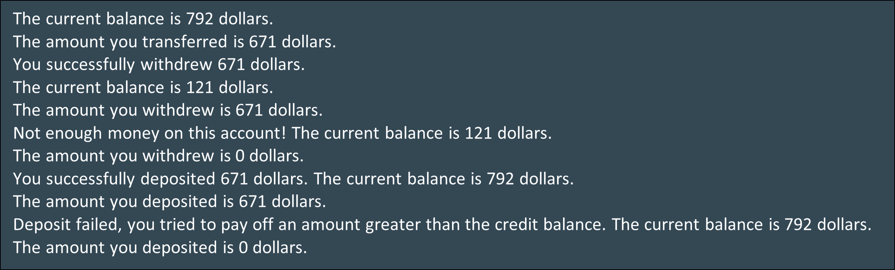
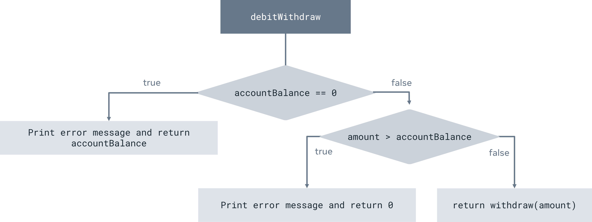
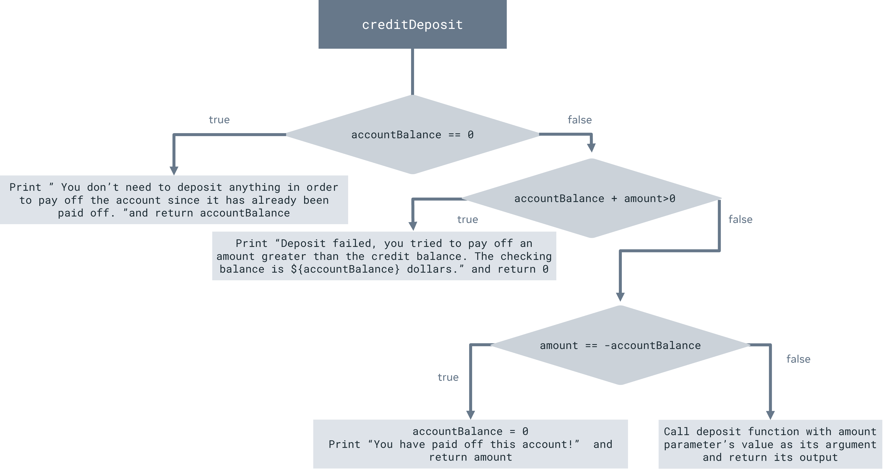
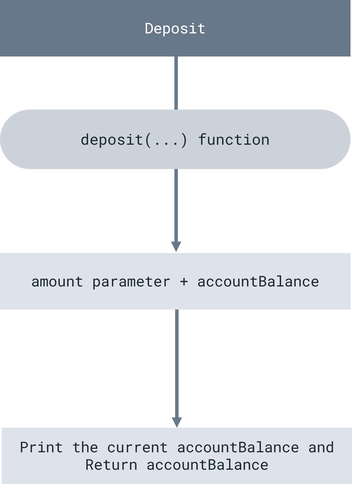

# Bank account project part 2

## Overview
In this exercise, you will practice working with functions and conditional statements 
to implement the bank account operations for the bank account you created in the previous exercise of the project. 
You will use all of these operations when you manage the bank account system in the last exercise of the project.

The account operations can be withdrawals or deposits of money. 
You will use functions and conditional statements to create the bank account’s operations and 
handle the logic of account withdrawals and deposits.

Your completed code will create an output similar to:

## Instructions

### Step 1: Create constants and variables
💡 **Tip:** _In Kotlin you can use the keywords var and val to create variables. 
   If var is used then the variable is re-assignable, which means its value can be changed. 
   When val is used the variable value is not re-assignable and this type of variable is often known as a constant._

1. First create a variable using the “var” keyword to store the account balance. 
   Name the variable for the bank account balance as `accountBalance`.
   Use the IntRange.random() method as (0..1000).random() to generate a random number between 1 and 1000 and
   assign it to the `accountBalance` variable.
2. Print the account balance to the console. 
   Use string interpolation to access the value of the `accountBalance` variable inside the print statement.
3. Then create a constant using the “val” keyword to store the amount of money used for account withdrawals and deposits and name it `money`.
   Use the `readln()` function to reads a line from the terminal and returns it as a String.
   Then, convert that string value into an Int number by using the `toInt()` function and assign it to the `money` constant.
4. Print the account balance and amount to be deposited/withdrawn to the console.
   Use string interpolation to access the value of the `money` constant inside the print statement.

### Step 2: Create a test variable
Create a variable for the output of the functions that we will define in the next step 
to handle the bank account’s operations such as deposits and withdrawals. 
Name the variable `output` and set its value to 0 (Zero). 
You will use this variable to test the output of the withdrawal and deposit functions when you run them. 
(You implement those functions in the next steps.)

### Step 3: The withdrawal operation for checking and credit bank accounts
Next, define the function that handles the logic of the withdrawal operation for checking and credit bank accounts.

1. Name the function `withdraw` and assign it one parameter named `amount`.
   The amount parameter is an integer and the function would also return an integer, 
   hence the definition would be `withdraw(amount: Int): Int`.
   The `amount` parameter and `withdraw(...)` function’s returned value represents the amount of money withdrawn from the account.
2. Use the subtraction assignment operator inside the body of the `withdraw(...)` function 
   to subtract the value of the `amount` parameter from the value of the `accountBalance` variable and 
   assign the result to the `accountBalance` variable. This means that you have withdrawn money from your bank account.
3. Print the amount of money withdrawn from your bank account and the account’s updated balance to the console 
   inside the `withdraw(...)` function’s body. 
   Use string interpolation to access the value of the `amount` parameter and `accountBalance` variable inside the `print` statement.
4. Return the `amount` parameter’s value from the `withdraw(...)` function inside the function’s body.

### Step 4: Test the withdrawal operation
Now, test the function that handles the logic of the withdrawal operation for checking and credit bank accounts.

1. Call the `withdraw(...)` function with the `money` variable’s value as its argument and 
   assign its result to the output variable.
2. Print the output of the `withdraw(...)` function to the console. 
   Use string interpolation to access the value of the output variable inside the `print` statement.

### Step 5: The withdrawal operation for debit accounts
Next, implement the function that handles the logic of the withdrawal operation for debit bank accounts.
Unlike checking accounts where the balance can be negative, 
debit bank accounts allow withdrawal only if there is a net positive balance present in the bank account.

**Create the function**

Name the function `debitWithdraw` and assign it one parameter named `amount`. 
The `amount` parameter is an integer and the `debitWithdraw(...)` function returns an integer, 
hence the function definition would be `debitWithdraw(amount: Int): Int`. 
The amount parameter represents the money to be withdrawn and `debitWithdraw(...)` function’s returned value represents 
the amount of money actually withdrawn from the account. 
The logic for this process is explained in this diagram.

Use an else/if statement inside the `debitWithdraw(...)` function’s body to check the status of the bank account’s balance. 
Configure the else/if statement as indicated below:

1. `if` **block:** Check if the `accountBalance` variable’s value is 0 to determine if there are funds available in the account. 
   Print "**Can't withdraw, no money on this account!**" inside the if block. 
   Return the `accountBalance` variable’s value.
2. `else if` **block:** Check if the `amount` parameter’s value is greater than the `accountBalance` variable value 
   to evaluate if there is enough money in the account to perform the withdrawal. 
   Print "**Not enough money on this account! The checking balance is** `${accountBalance}` **dollars.**". 
   Return 0 from the `debitWithdraw(...)` function inside the else if block. 
   This means that no money has been withdrawn because the account’s balance is lower than the withdrawal amount.
3. `else` **block:** Finally, call the `withdraw(...)` function with the amount parameter’s value as its argument and 
   return its output from the `debitWithdraw(...)` function inside the else block. 
   This means that the user can continue with the withdrawal because 
   the amount of money they want to withdraw is less than or equal to the account’s balance.

### Step 6: Test the withdrawal operation
Now test the function that handles the logic of the withdrawal operation for debit bank accounts.

The logic for the debit withdraw process is explained in this diagram.

1. Call the `debitWithdraw(...)`  function with the value of the money variable as its argument and 
   assign its result to the `output` variable.
2. Print the output of the `debitWithdraw(...)` function to the console. 
   Use string interpolation to access the value of the `output` variable inside the `print` statement.

### Step 7: The deposit operation for checking and debit accounts
Next, you will implement a function that handles the deposit operation for checking and debit bank accounts.

Create the function. Name the function `deposit` and assign it one parameter named `amount`.

The amount parameter is an integer and the `deposit(...)` function returns an integer, 
therefore the function definition is `deposit(amount: Int): Int`. 
The `amount` parameter and the `deposit(...)` function return values that represent the amount of money deposited into the account.

1. Use the addition assignment operator inside the `deposit(...)` function’s body 
   to add the value of the `amount` parameter to the value of the `accountBalance` variable and 
   assign the result to the `accountBalance` variable. 
   This means that you are depositing money into the bank account.
2. Print the amount of money deposited to your bank account and 
   the account’s updated balance to the console inside the `deposit(...)` function’s body. 
   Use string interpolation to access the value of the `amount` parameter and `accountBalance` variable inside the print statement.
3. Inside the `deposit(...)` function’s body, 
   return the `amount` parameter’s value from the `deposit(...)` function.

### Step 8: Test the deposit operation for checking and debit accounts
Now test the function that handles the logic of the deposit operation for checking and debit bank accounts.

1. Call the `deposit(...)` function with the money variable’s value as its argument and 
   assign its result to the output variable.
2. Print the output of the `deposit(...)` function to the console. 
   Use string interpolation to access the value of the output variable inside the print statement.

### Step 9: Implement the deposit operation for credit accounts
Next, implement the function that handles the logic of the deposit operation for credit bank accounts.

The logic for this operation is illustrated in the diagram below.

1. Create the function. 
   Name the function `creditDeposit` and give it a parameter named `amount`.
   The `amount` parameter is an integer and the `creditDeposit(...)` function returns an integer, 
   hence the function definition would be `creditDeposit(amount: Int): Int`. 
   The amount parameter represents the amount of money to be deposited and 
   `creditDeposit(...)` function’s return value represents the amount of money actually deposited into the account.
2. Use an `if else if` statement inside the `creditDeposit(...)` function’s body to check the state of the bank account’s balance. 
   First, check if the balance variable’s value is 0 to verify if you have any money in your bank account.
3. Print the deposit’s status to the console inside the if block of the `creditDeposit(…)` function’s body. 
   You don’t need to deposit anything in order to pay off the account since it has already been paid off.
4. Return the balance variable’s value from the `creditDeposit(...)` function inside the if block of the `creditDeposit(...)` function’s body. 
   The balance variable’s value is 0 because you don’t have any money in your bank account in this case.
5. Now verify if the sum of the balance variable’s value and the `amount` parameter’s value is greater than 0 
   inside the `creditDeposit(...)` function’s body to see how much money you want to deposit in order to pay off the account.
6. Print the credit account’s status and account’s balance to the console 
   inside the first `else if` block of the `creditDeposit(...)` function’s body. 
   Use string interpolation to access the value of the balance variable inside the print statement -
   **Deposit failed, you tried to pay off an amount greater than the credit balance. 
   The checking balance is** `${accountBalance}` **dollars.**
7. Return `0` from the `creditDeposit(...)` function inside the first `else if` block of the `creditDeposit(...)` function’s body. 
   This means that you haven’t deposited any money to your bank account because 
   the amount you want to deposit is higher than the amount that needs to be deposited to pay off the credit balance.
8. Next check if the `accountBalance` variable’s value is the opposite of the `amount` parameter’s value 
   inside the `creditDeposit(...)` function’s body to verify that you deposit just enough money 
   in order to completely pay off the account.
9. Print the updated deposit’s status inside the second `else if` block of the `creditDeposit(...)` function’s body. 
   You deposited just enough money in order to completely pay off the account in this case.
10. Return the `amount` variable’s value from the `creditDeposit(...)` function 
    inside the second `else if` block of the `creditDeposit(...)` function’s body. 
    This is the amount you deposit to your bank account in order to completely pay off the account.
11. Finally, call the `deposit(...)` function with the `amount` parameter’s value as its argument and 
    return its output from the `creditDeposit(...)` function inside the `else` block of the `creditDeposit(...)` function’s body. 
    This means that the amount of money you deposit to your bank account can only pay off the account partially in this case.

### Step 10: Test the deposit operation
Finally, test the function that handles the logic of the deposit operation for credit bank accounts. 
You can see the overall logic of the process in the diagram below.

1. Call the `creditDeposit(_:)` function with the `money` variable’s value as its argument and 
   assign its result to the `output` variable.
2. Print the output of the `creditDeposit(_:)` function to the console. 
   Use string interpolation to access the value of the `output` variable inside the `print` statement.

### Step 11: Run your code
Run your program and write down the output.

The first printed statement should read: “**The checking balance is 210 dollars.**”.

<aside>
💡 Note: Since you use random numbers to generate the bank account’s balance, your output may have a different dollar value.

</aside>

## Concluding thoughts
In this part two of the bank app project, you worked with functions and conditional statements to create your bank apps’ operations. 
You will use these operations to manage your bank account in the final part of the project.

[Back](README.md)