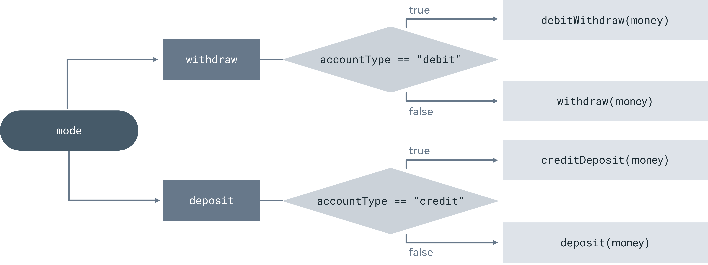
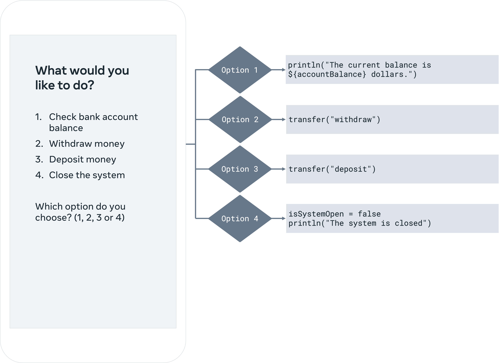

# Bank account project part 3

## Overview

In this exercise, you will practice working with functions, loops, conditional statements and `when` expressions. You will write code to manage the bank account you created in the first part of the project. Also, you will execute different bank account operations that you already defined as functions in the second part of the project.

The bank account type can be a checking, a debit or a credit bank account. The account’s operations are withdrawals or deposits.

When finished, your output will be similar to:


## Instructions

### Step 1: Add the starter code to the playground
First, add the required starter code of the exercise to the playground. You have already implemented this code in the previous two parts of the project.

```kotlin
fun main() {
    println("Welcome to your banking system.")
    println("What type of account would you like to create?")
    println("1. Debit account")
    println("2. Credit account")
    println("3. Checking account")
    var accountType = ""
    var userChoice = 0
    while (accountType == "") {
       println("Choose an option (1, 2 or 3)")
       userChoice = (1..5).random()
       println("The selected option is ${userChoice}.")
       
       when (userChoice) {
           1 -> accountType = "debit"
           2 -> accountType = "credit"
           3 -> accountType = "checking"
           else -> continue
       }
    }
    println("You have created a ${accountType} account.")
 
    var accountBalance = (0..1000).random()
    println("The checking balance is ${accountBalance} dollars.")
    val money = (0..1000).random()
    println("The amount you transferred is ${money} dollars.")
 
    fun withdraw(amount: Int): Int {
        accountBalance -= amount
        println("You successfully withdrew ${amount} dollars. The checking balance is ${accountBalance} dollars.")
        return amount
    }
 
    fun debitWithdraw(amount: Int): Int {
        if (accountBalance == 0) {
            println("Can't withdraw, no money on this account!")
            return accountBalance
        } else if (amount > accountBalance) {
            println("Not enough money on this account! The checking balance is ${accountBalance} dollars.")
            return 0
        } else {
            return withdraw(amount)
        }
    }
 
    fun deposit(amount: Int): Int {
        accountBalance += amount
        println("You successfully deposited ${amount} dollars. The checking balance is ${accountBalance} dollars.")
        return amount
    }
    
    fun creditDeposit(amount: Int): Int {
        if (accountBalance == 0) {
            println("This account is completely paid off! Do not deposit money!")
            return accountBalance
        } else if (accountBalance + amount > 0) {
            println("Deposit failed, you tried to pay off an amount greater than the credit balance. The checking balance is ${accountBalance} dollars.")
        	return 0
        } else if (amount == -accountBalance) {
            accountBalance = 0
            println("You have paid off this account!")
            return amount
        } else {
            return deposit(amount)
        }
    }
   
}
```

The above code creates a valid bank account and implements bank account operations – withdrawals and deposits. You will use this code to manage the bank account in the next steps of the exercise.

### Step 2: Implement the transfer operation for the account categories

Next implement the function that handles the transfer logic of withdrawals and deposits for checking, debit and credit accounts.

First create the function’s prototype. Name the function `transfer` and give it a parameter named `mode`. The `mode` parameter is a string and the `transfer(...)` function doesn’t return anything, hence the function definition would be `transfer(mode: String)` The `transfer(...)` function’s parameter value represents the direction of bank account transfer. It can either be a withdrawal or a deposit.

This diagram summarizes the logic of the following parts of this step.



1. Next create a constant by using `val` keyword for the account transfer’s amount inside the body of the `transfer(...)`  function. Name it `transferAmount` and set its integer type explicitly because you don’t know its value yet so you can’t use type inference to determine its data type based on its value.
2. Add a `when` expression inside the `transfer(...)` function’s body which based on the mode variable’s value executes code for either a withdrawal or a deposit.
3. For “**withdraw**” as mode value, add an if-else statement to check if the `accountType` is of type “**debit**”. This verifies that the bank account is a debit account. For this case, call the `debitWithdraw(...)` function with the `money` constant’s value as its argument and assign its result to the `transferAmount` constant within the `if` block. The bank account is a debit account type and you are performing a debit withdrawal from it.
4. The `else` case will get executed if it is not a debit bank account. Therefore, within the `else` block call the `withdraw(...)` function with the money constant’s value as its argument and assign its result to the `transferAmount` constant inside the `else` block. The bank account is either a checking account or a credit account and you are performing a withdrawal from it.
5. Print the result of the withdrawal operation with the message: **The amount you withdrew is** `$transferAmount` **dollars.**
Use string interpolation to access the value of the `transferAmount` constant inside the print statement.
6. In the case of a deposit, add an if-else statement to check if the `accountType` is “**credit**”. If yes, it means that you are verifying that the bank account is a credit account.
7. Call the `creditDeposit(…)` function with the `money` constant’s value as its argument and assign its result to the `transferAmount` constant inside the if block. The bank account is a credit account, and you are performing a credit deposit to it.
8. The else case will get executed if it is not a credit bank account. In this case, call the `deposit(…)` function with the money constant’s value as its argument and assign its result to the `transferAmount` constant inside the `else` block. The bank account is either a checking account or a debit account and you are performing a deposit to it.
9. Print the result of the deposit operation with the message - **The amount you deposited is `$transferAmount` dollars.**
Use string interpolation to access the value of the `transferAmount` constant inside the print statement.
10. Add an else case to the when expression block inside the `transfer(…)` function’s body to make it exhaustive. The else case handles all values of the mode parameter that other cases don’t handle. Use a return statement inside the else case of the when expression in the `transfer(…)` function’s body to exit without doing anything else. This means that no account transfer happens because the mode of the account transfer isn’t valid, it is neither deposit nor withdrawal.

You will test the `transfer(…)` function in the next steps.

### Step 3: Create variables for the banking account app interface status and user interface option

Now create variables that store the banking account app interface’s status and the user interface’s selected option from the console.

1. Create a variable for the interface status. Call it `isSystemOpen` and set its value to `true`. This means that the system is open by default.
2. Create a variable for the user interface’s selected option. Name it `option` and set its value to 0.

### Step 4: Manage the bank account based on the user interface option

Next, manage your bank account and perform its specific operation based on the user’s input. The user input would be processed like this:



Remember that you are generating random numbers for the user’s input because Playgrounds can’t process user input by default.

1. Define a `while` loop that handles the user’s input and performs the corresponding bank account’s operation. The loop repeats itself as long as the `isSystemOpen` variable’s value is true. This means that the banking app interface is open so you can still perform bank account operations on your bank account. The `while` loop repeats itself at least once so you get to perform at least one account operation on your bank account until the banking account app interface closes.
    
    Use print statements to display the following on the interface:
    
    ```
    What would you like to do?
    1. Check bank account balance
    2. Withdraw money
    3. Deposit money
    4. Close the app
    
    Which option do you choose? (1, 2, 3 or 4)
    ```
    
2. Generate a random number between 1 and 5 for the user’s input inside the loop. The `IntRange.random()` method uses a closed range of integers that defines the lower and upper bounds of the generated random numbers. Assign the generated random number to the `option` variable.
3. Print the generated random number to the console inside the loop. Remember that this is the input from the user in this case. Use string interpolation to access the value of the option variable inside the `print` statement.
4. Declare inside the loop a when expression that selects the right bank account operation from the list of bank account operations provided by the banking app interface. The expression executes relevant code based upon the option variable’s value and performs any valid bank account operation accordingly.
5. When the option variable’s value is 1, print the balance of the bank account. Use string interpolation to access the value of the balance variable inside the `print` statement.
6. When the option variable’s value is 2, call the `transfer(...)` function with the “withdraw” string as its argument. This means that you are performing a withdrawal from your bank account.
7. When the option variable’s value is 3, call the `transfer(...)` function with the “**deposit**” string as its argument. This means that you are performing a deposit to your bank account.
8. When the option variable’s value is 4, assign “**false**” to the `isSystemOpen` variable. This means that the app interface is now closed and the `while` loop stops once it reaches the end of its checking iteration. Print the updated status of the app interface as closed.
9. Add an `else` case to the `when` expression inside the loop in order to make it exhaustive. The `else` case handles all values of the option variable that other cases don’t handle. Add a `continue` statement inside the `else` case to exit the when expression without doing anything else. This means that no bank account operation is performed when the user’s input is invalid.

### Step 5: Run your code

Run your program and write down the output.

The first printed statement should be “**What would you like to do?**”.

## Concluding thoughts

In this exercise you worked with functions, loops, conditional statements and when expressions to manage your bank account’s withdrawals and deposits.

[Back](README.md)