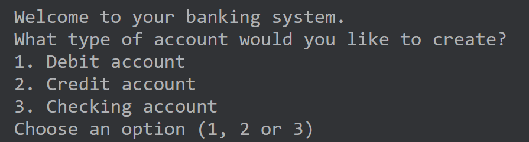
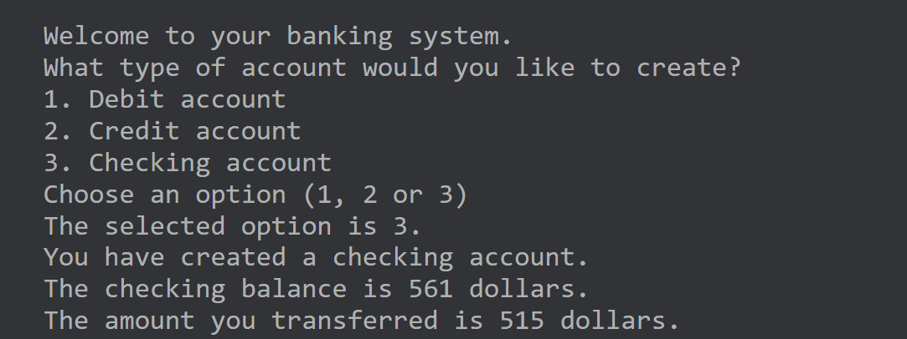

# The bank account project

## Project overview
In this course, you continually tested your skills in exercises, knowledge checks, and in-video questions. 
Next, you will apply the coding abilities you have gained in a project scenario. 
You will use Kotlin code to create a bank account application.

You will create a banking app that can:
- Create bank accounts 
- Validate user input 
- Check account balances
- Process deposits and withdrawals

You will create this opening screen that allows the selection of an account type.

And produce this type of output when handling the transfer of money.

## The coding
You will work with constructs such as functions, loops, conditional statements and `when` expressions 
to create the functionality of the banking account app. 
The banking operations are defined in a set of functions grouped together in the structure of the project. 
The logic of the app will use loops to process user input and create bank accounts. 
Based on the user input, control flow statements such as conditional statements and 
`when` expressions execute the banking operations and make sure the banking account app runs smoothly.

## Project details
The project is divided into three parts. 
Each part gives you full guidance, feedback and solutions. 
The sequence and the content of the three project parts simulate the type of software development progression 
that would happen in a real-world build of such an app.

### Part 1: Build the visual user interface (UI) and set up accounts
In this first part, you will create the app to allow a user to choose from three different bank account types: 
credit, debit and checking. 
This work includes:
- Print the names of the three bank account types to the console. 
- Use loops to create a new bank account based on the user’s choice. 
- Use a `when` expression to validate user input and select the required bank account type.

[Read more](./Part-1.md)

### Part 2: Define bank account operations
For each account type, configure the app to operate the deposit and withdrawal of funds.
- Use functions to create valid and appropriate bank account operations based on the bank account types. 
- Configure conditional statements to implement the logic of withdrawals and deposits in bank accounts.
  
[Read more](./Part-2.md)

### Part 3: Manage the bank account
After a bank account is created and operations are defined, process user input commands to manage a bank account.
- Use functions to manage money withdrawals and deposits.
- Use loops to process multiple user commands for the given bank account. 
- For a money transfer, use conditional statements to select the bank account’s operation based on the bank account’s type. 
- Use `when` expressions to choose the right bank account operation from the list of valid bank account operations.

[Read more](./Part-3.md)

## Learning aims
The purpose of this project is to:
- Evaluate your understanding of key learning objectives. 
- Help you to recognize which topics you have mastered. 
- Identify topics that may require further study.
- Give you an opportunity to demonstrate what you have learned. 
- Consolidate your understanding of Kotlin programming fundamentals. 

No part of the project has task levels that exceed what you have learned. 
You have progressed your learning since week one and remember that you can still go back to any lesson, of any week, 
at any time to revise content. 
As a result, you should be well-placed to succeed with this project. Good luck and enjoy your coding!
