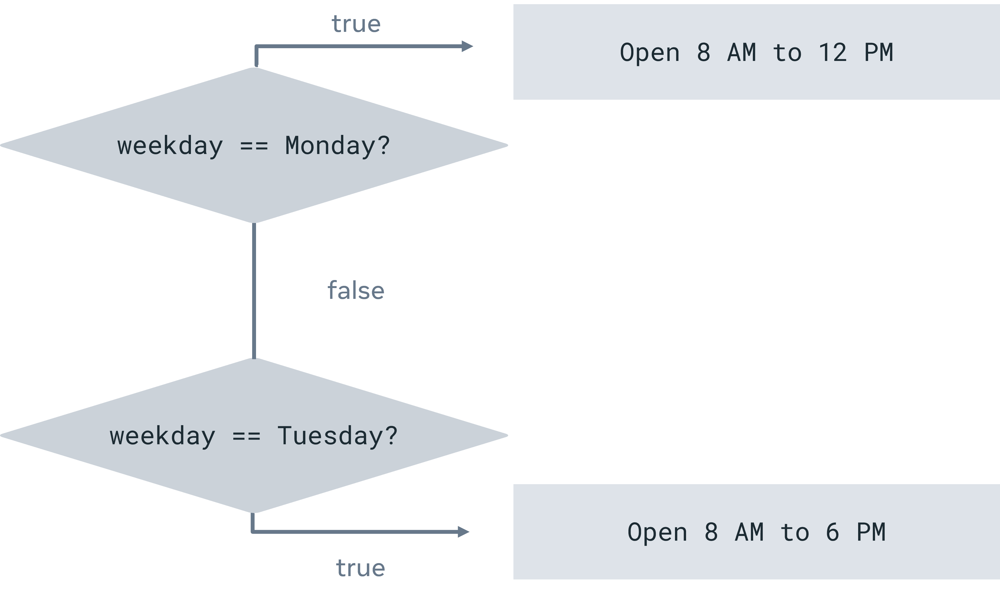

# Exercise: Practice using conditions

## **Overview**

In this exercise, you will practice using **if** , **if-else-if** and **when** statements.

## **Scenario**

The Little Lemon cafeteria opens at various times depending on the day of the week, according to the following table:

| Day       | Times                        |
|-----------|------------------------------|
| Monday    | 8 AM to 12 PM (8:00 - 12:00) |
| Tuesday   | 8 AM to 6 PM (8:00 - 18:00)  |
| Wednesday | 8 AM to 6 PM (8:00 - 18:00)  |
| Thursday  | 8 AM to 6 PM (8:00 - 18:00)  |
| Friday    | 8 AM to 9 PM (8:00 - 21:00)  |
| Saturday  | 9 AM to 4 PM (9:00 - 16:00)  |
| Sunday    | 8 AM to 4 PM (8:00 - 16:00)  |

## **Instructions**

## **Task 1**

Your first task is to write a program that, based on a weekday, prints opening hours.

The general logic of this exercise is illustrated in the diagram below.



Follow the steps below to create your code.

### **Step 1: Create a variable**

Declare a variable named **weekday** using the **val** keyword and set it to the string **"Friday"**.

Your code should be like this:

```kotlin
val weekday = "Friday"
```

### **Step 2: Print the weekday**

Before actually printing the opening hours for a given day, let's also add a  **println** statement for the following message which will consist of the day name for which the hours shall be printed. For Friday, it shall be **"On Friday, the opening hours are:".** However, to make the value of the day name dynamic, replace **“Friday”** with a dollar sign followed by the name of the variable `weekday` as follows: **“$weekday”**. This is called **“string interpolation”**.  It prints the value of the weekday variable. 
The final string should look like this:

```kotlin
println("On $weekday, the opening hours are:")
```

Next, inside the parentheses, add the text that you would like to display in the console when the print statement is executed. For example, you can add this, **"On Friday, the opening hours are:"**.

In a new line, insert the keyword println followed by parentheses. It should read like this: `println()`

### **Step 3: Use if-else-if, to print opening hours**

Use if-else-if, to print opening hours for each possible weekday value. Check if it works fine by modifying the `weekday` variable with different weekdays and checking the result.

You should now have an if-else-if statement that begins like this:

```kotlin
if (weekday == "Monday") {
		println("8 AM to 12 PM")
} else if (weekday == "Tuesday") {
		println("8 AM to 6 PM")
}
```

### **Alternative Step 3: Alternatively use  when to print opening hours**

**Note:** This is not an extra step in the code, it's just an alternative way to implement step 3.

Instead of using **if-else-if**, you can use a **when** statement to print opening hours for each possible weekday value.

For instance, a **when** statement for Monday would be coded like this:

```kotlin
when {
    weekday == "Monday" -> println("8 AM to 12 PM")
}
```

Now, just as you did with the **if-else-if** statement, proceed to add similar lines of code within the **when** statement to handle the other days of the week.

### **Step 4: Run your code**

Run your program and write down the output.

## **Task 2**

Your second task is to make a program that, based on a weekday and the opening hours, it prints either **"Little Lemon is open now"** or **"Little Lemon is closed now"**. Either **if-else-if** or **when** could be used to implement this.

**Tip:** *In such situations, the* **when** *statement often results in cleaner, more readable code. In this example, you will use* **when***.*

### **Step 1: Create a variable**

Declare a variable named `weekday` using the `val` keyword and set it to the string **"Friday"**. 
Your code should look like this:

```kotlin
val weekday = "Friday"
```

In a new line declare a new variable named `hour` using the `val` keyword. The hour variable will store the time of the day for which you want to check if Little Lemon is open. Let's set it to the number **20**, representing 8 PM. Your code should look like this:

```kotlin
val hour = 20
```

**Tip:** *Often you will see time written as in the Little Lemon opening hours, for instance as -*  **“8 AM to 6 PM”***. In the code, the variable called* `hour` *is set to 20 because you calculate the* **when** *expressions using the 24-hour clock. Instead of* **“8 AM to 6 PM”** *the 24-hour clock allows us to determine the opening hours using 8:00 to 18:00. Using a day duration of 00:00 to 24:00 makes it much easier to convert time periods into code.*

**Step 2: Use when** **to check opening hours**

Declare a variable `isOpen` using the `val` keyword and set it to a **when** expression to check if Little Lemon is open now or closed.

You should now have a **when** statement like this:

```kotlin
val isOpen = when (weekday) {
    "Monday" -> hour >= 8 && hour <= 12
}
```

Now, just as you did with the previous task, proceed to add similar lines of code within the **when** expression to handle the other days of the week and opening hours.

**Tip:** *In this case the* **else** *branch is mandatory, so don’t forget to add an* **else** *branch at the very end of the when expression. Remember that when you use the* **when** *as an expression, the else branch is mandatory, unless the compiler can prove that all possible cases are covered with branch conditions.*

**Tip:** Remember about using ranges in **when** statements? The  **when** expression can be simplified, by using  a **range check**. As an alternative, you can edit the previous code block to use **range** `hour in 8..12` instead of  using `hour >= 8 && hour <= 12`.

### **Step 3: Check Lemon’s opening status**

In a new line, check if the result of **isOpen** is true or false. If it is true, print **“Little Lemon is open now"**. If it is false, print **"Little Lemon is closed now"**.

### **Step 4: Run your code**

Run your program and write down the output.

## **Concluding thoughts**

In this exercise you used **if-else-if** and **when** statements for multiple conditions.
