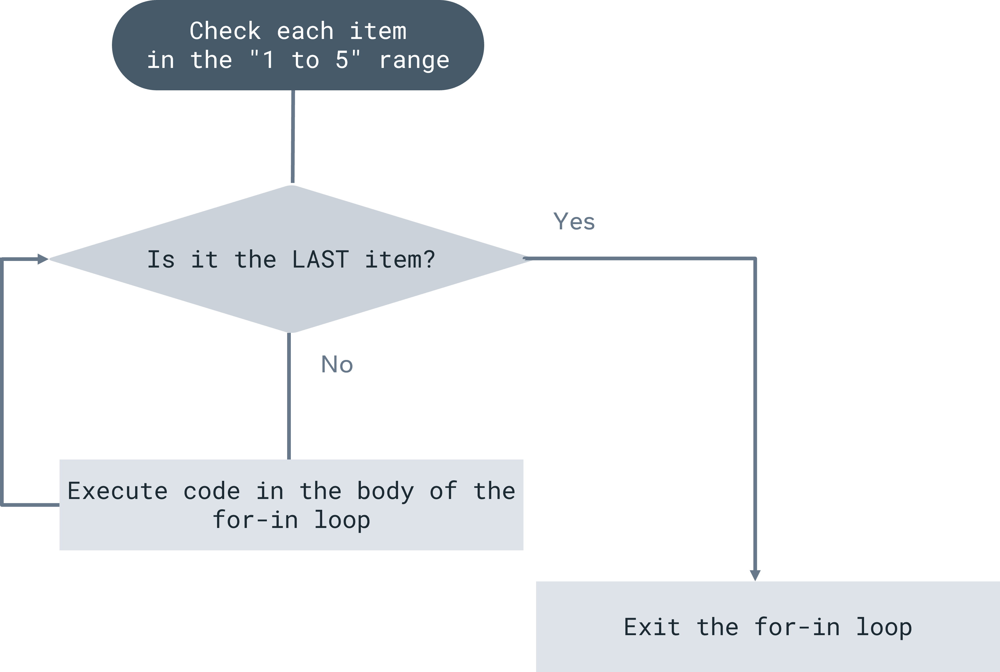

# Exercise: Practice creating Loops

## **Overview**

In this exercise, you will practice using nested ‘for in’ loops to print different kinds of shapes.

## **Scenario**

Suppose you are creating a simple shape generator. In such an app you would need to use nested ‘for in’ loops to iterate through adding an asterisk character (*) at different intervals and form a specific shape of your choice. In this exercise, you will practice using nested ‘for in’ loops to print different kinds of shapes formed by a pattern of spaces and asterisks characters (the asterisk is also known as the ‘star’ symbol).

## ****Instructions****

## **Task 1**

The first task is to display the following triangle built using star symbols:
```
****
****
***
**
*
```

This triangle has five lines. Each line has 1 star less than the previous line, and all stars are aligned to the right. To create this shape, you will need one 'for in' loop nested inside another 'for in' loop. The outer loop will iterate down the lines of the shape, and the inner loop will iterate across the characters in each line.

The overall logic of this task is illustrated in the diagram below.



### **Step 1: Create a for in loop for making each line**

First, declare the outer ‘for in’ loop that iterates down the lines of the shape. The loop should use a closed range that iterates multiple times (in this case, 5 times since there are 5 lines).

You should now have the first loop that iterates over the "1...5" range.

```kotlin
for (i in 1..5) { }
```

### **Step 2: Create a variable to represent the number of spaces to print on a line**

Since the stars are right aligned, you need to print the space characters first. For each line, you will need to know how many spaces and how many asterisks to print. Create a variable `numberOfSpaces` to represent the number of spaces that a line should have before stars are printed. Set ****`numberOfSpaces` equal to an equation that calculates the number of spaces correctly based on which line is being printed.

***Tip:** Remember that the lines are represented by the variable i. When i = 1 (representing the first line), there are 5 stars and when i = 2 (representing the second line), there are 4 stars. This regular pattern continues to the end of the shape and can be represented with an equation.*

In your code, it should look like this:

```kotlin
val numberOfSpaces = i - 1
```

### **Step 3: Create a for in loop that prints the correct number of spaces**

Now, you will need `for in` loops *inside*  the one you already created to print the correct number of spaces and stars on each line. First, declare a `for in` loop to print the number of spaces based on your `numberOfSpaces` variable. The loop should use a closed range, so here we have a starting number and an ending number.

You should now have a second loop that iterates over the "1.. `numberOfSpaces`" range.

```kotlin
for (j in 1..numberOfSpaces) { }
```

### **Step 4: Print the space**

Within the loop from step 3, print space to the console.

It should look like this:

```kotlin
print(" ")
```

### **Step 5: Create a variable to represent the number of stars to print on a line**

Create a variable `numberOfStars` that will define how many stars a line should have. Similar to how you did in Step 2, set this variable equal to an equation that calculates the number of stars based on the line number, `i`.

It should look like this:

```kotlin
val numberOfStars = 6 - i
```

### **Step 6: Create a for in loop that prints the correct number of stars**

Now, declare a `for in` loop to print the number of stars based on your `numberOfStars` variable. Like your 'for in' loop in Step 3, this loop will also be nested inside your outer 'for in' loop.

You should now have a loop that iterates over the "`1... numberOfStars`" range.

```kotlin
for (j in 1.. numberOfStars) { }
```

### **Step 7: Print the star**

Within your loop from Step 6, print a star to the console. This will finish off each line with the correct number of stars.

It should look like this:

```kotlin
print("*")
```

### **Step 8: Use println to start a new line after each iteration of your outer loop**

After your code prints the correct number of spaces and stars on a line, it needs to jump to new line before starting the next line of the shape. To do this, use `println()` at the end of the body for your outer loop.

### **Step 9: Run your code**

Run your program and write down the output.

## **Task 2**

Now that you have created a triangle using a `for in` loop, you should now attempt to use `for in` loops to display the triangle shape below. You can use the steps in Task 1 as a guide to solving this task.
```
********
*******
*****
***
*
```

## **Task 3**

Various shapes can be built by using `for in` ****loops in this way.  For this task attempt to use `for in` loops to display the triangle shape below. You can use the steps in Tasks 1 and 2 as a guide to solving this task.
```
*
**
***
****
****
****
***
**
*
```

**Tip:** *Avoid using too many nested loops in your solution. This may slow down the performance of your code.*

## **Concluding thoughts**

In this exercise, you practiced using nested `for in` loops to print different kinds of shapes. This prepares you for future coding exercises where loops will often be part of the programming requirement.