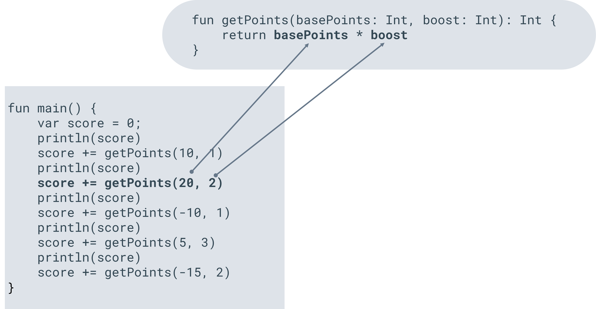

# Exercise: Practice using functions with results

## Overview

In this exercise, you will practice defining a function that uses multiple parameters and returns a result.

## Scenario

Function parameters and returning values are important parts of programming. Let’s say you are developing a game, and you need to keep track of the score. As someone plays the game, you need to add points to their score. The score might be boosted if the player picked up a special item.

In this exercise, you’ll create a simple function that calculates the total points to be added to the score. The function will have two parameters, one for the base number of points and another for the boost value. The boost value will be multiplied by the base amount.

## Instructions

### Step 1: Set up the initial code

Copy and paste the following starter code into your playground. In this exercise, you will complete this code by creating the function `getPoints`. The starter code will keep track of the total score by adding points to the current score.

```kotlin
//Add your function below this line
fun main() {
    var score = 0
	println(score)
    score += getPoints(10, 1)
	println(score)
    score += getPoints(20, 2)
	println(score)
    score += getPoints(-10, 1)
	println(score)
    score += getPoints(5, 3)
	println(score)
    score += getPoints(-15, 2)
}
```

### **Step 2: Define the function name**

The first line of the code has the following comment.

```kotlin
//Add your function below this line
```

Below this line is where you’ll add your function.

First, define the function. Remember, a function definition starts with the `fun` keyword followed by the function name. For this exercise, name the function `getPoints`.

### **Step 3: Define the function parameters**

After `getPoints` add an open parenthesis.

Now define the first parameter. Remember, a parameter is defined by its name first, followed by a colon character, followed by the parameter type. For this exercise, the first parameter will be named `basePoints` and the type will be `Int`.

Next, define the second parameter. Remember that parameters are separated by a comma. Add the comma after the type of the first parameter.

The second parameter will be named `boost` and again the type will be `Int`.

Finally, add a close parenthesis after the second parameter type. You have now defined the parameters.

In the diagram below the connection between `getPoints` ****and the parameters is shown.



### **Step 4: Define the function return type**

The return type of the function is specified after the parameters.

To specify this, add a colon character after the close parenthesis. Then specify the type. In this case, the type will be `Int`.

You are now ready to implement the function.

### **Step 5: Implement the function**

Add an open curly bracket after the return type.

Go to a new line and then add another new line.

Add a close curly bracket.

Inside these brackets you will implement the function.

The function will return the `basePoints` value multiplied by the `boost` value.

To return a value you use the ****`return` ****keyword. So first add the return keyword and then specify `basePoints` multiplied by **boost**.

### **Step 5: Run the code**

Run the code and the following should display in the console:

```
0
10
50
40
55
```

## **Concluding thoughts**

In this exercise, you practiced creating a function that has two parameters and returns a value. As a developer, you will write many functions as you create larger and more complex programs.