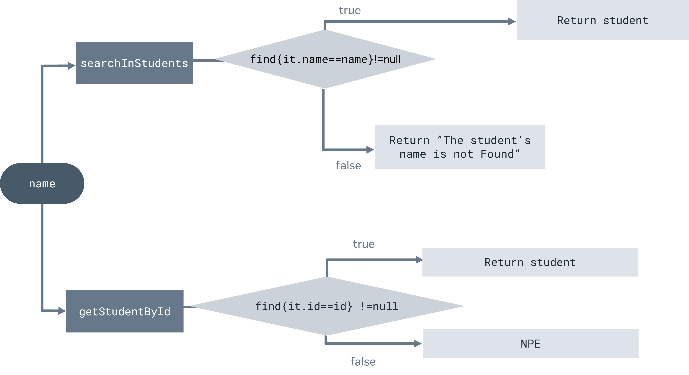

# Exercise: Practice handling nullability

Nullability is the programming concept where a variable has an absence of any value. In Kotlin, you can use null to indicate that a variable has no value.

In this exercise, you will practice how to handle nullable values and avoid NPE or null pointer exceptions.

To accomplish this, there are a few different approaches that can be taken such as; check for null in a condition, use safe calls, the Elvis Operator or the assertion operator 

This exercise concentrates on these two approaches

- Elvis Operator
- Assertion operator

## Scenario

Let’s say that you are helping the IT department of a large school. The school has a list of students. You want to allow the staff to search and retrieve a student’s information using either their name or their student ID. To allow for two search phrases you need two functions. One is for locating a student by ID and the other is for locating a student by name. You should consider that, in a real-world project, the student ID is normally generated by the system for each student. Therefore, you can depend on it being accurate and being present for each stored student. So, if the user searches for a student by ID and that ID is not present, the program should return **null** or error since that ID does not match with any of the stored IDs. If the user searches for a student by name and that name is not present, then the program should display "**The student is not found**".

In future steps of this exercise, you will handle both possibilities, for now just keep in mind that you need to return *an error* if the user enters an ID that is not stored and NPE is returned. "The student is not found" returns if an entered name does not match with any of the stored student names.

To summarize the requirements of this exercise:

1. Create a `Student` ****class with three arguments `Id` as Int, `name` ****as String and `grade` as Double then create a list of students
2. Create a `getStudentById` function that has one parameter called `id` ****as an Int, that returns a student
3. Create a `searchInStudents` function that has one parameter called `name` ****as a String, that returns a nullable student
4. Get the values from the user that will be searched for

Using test values as input samples, the expected output of the entire exercise will look like similar to this:


The logic of your work in this exercise is illustrated in this diagram.



## Instructions

## Step 1: Create a Student class and student list**

As described in the scenario, you need to create a **Student** data class with the following arguments:

```kotlin
val fullName:String
val grade:Double
val id:Int
```

For the next part of the task, you need to create a list of students in a class scope - which means outside the main function, in that way, the other function you create in this exercise can access that list

Create a list with the following values - This list is called **student**

| ID  | Name   | Score |
|-----|--------|-------|
| 223 | John   | 140.0 |
| 548 | Mark   | 120.0 |
| 342 | Natali | 150.0 |
| 781 | Sara   | 130.0 |

## Step 2: Create a `getStudentById` function

In this step, you need to return the student from the student list and if not found, the program should return NPE. In our scenario, as mentioned, if the user wants to get a student by an ID that is not present in the list, the program should display an error. To search in the **student** list you can use a **find** method.

To achieve an efficient search, you need to use the **find** method inside the function and if any student ID matches the ID entered by the user, you should return that student. If not, you should display an error as a Null pointer exception by using the null assertion operator **!!** Why is that the best method to use here? Because if we get null the assertion operator can display an NPE.

The function should be like this:

```kotlin
fun getStudentById(id:Int):Student{ 

}
```

For example:

```kotlin
val listOfInt = listOf<Int>(1,2,4)
val myInt= listOfInt.find{it==5} !! // here we use the null assertion operator
```

The `find` function iterates over the list and **it** (in `it == 5`) represents each individual item. Take into consideration that the find function returns a nullable value - which means if we want to find 5 in listOfInt, myInt will be null since 5 is not in the list - as a result, the program will display NPE because of the null assertion operator **!!**.

**Note:** *In a real-world situation, the assertion operator is typically used with a value only when you are sure that the value won’t be null at any point of the code.*

## Step 3: Create a `searchInStudent` function

Next, you need to create a function called `searchInStudents` ****with one string argument and return a nullable `Student`. Kotlin uses its type structure to recognize variable references that can hold a null.  In this function, you will use `Student?` To create a nullable Student, in other words, the function can return null or student.

It should look like this:

```kotlin
fun searchInStudents(name: String): Student? {
}
```

After that, you need to search in the `students` ****list for `name` by using a `find` function and if the name matches with any of the stored student names, the `find` **will return that student instance.

**Note**: the returned student instance is nullable, therefore the `searchInStudents` function is created with a nullable student to return, by using `Student?`

**Note**: When you compare two strings, it’s recommended to use the `lowercase()` or `uppercase()` ****function, since in KOTLIN, ‘A’ doesn't equal to ‘a’, it is case-sensitive in a string comparison, therefore first you need to lowercase or uppercase both sides before comparison.

## Step 4: Get the values from the user

In this step, you would take a user input from the standard input stream which is the terminal (known as the **********Run Window********** in IntelliJ). To accept the user input, use the `readln()` function which reads a line from the terminal and returns it as a ************String************. Then you can convert that string value into an ******Int****** number by using the `toInt()` function and finally assign it a variable. To make it more user-friendly you should print something like “Please enter the ID of a student” and then take the input.

The code should be like this:

```kotlin
println("Please Enter the ID of the student")
val id: Int = readln().toInt()
```

Then call the `getStudentById` function with `id` as the argument.

The code should be like this:

```kotlin
val student = getStudentById(id)
```

Finally, display the result on the screen.

```kotlin
println(student)
```

Repeat the same step with the `searchInStudent` function. But instead of printing results directly, you will use the Elvis operator `?:` to check whether the result is null or not. Why use the Elvis operator in this scenario? It is because when it is null, you can print “******************************************The student is not found******************************************”, instead of printing null.

## Step 5: Run your code

Run your code to test it.

The code should look like this:

```kotlin
println("Please, Enter the student's ID")
val id = readln().toInt()
println( getStudentById(id))
println("Please, Enter the student's name")
val name= readln()
println(searchInStudents(name)?:"The student is not found")
```

### Test 1

In this first test, you will use values that exist in the `students` ****list. Inside the main function, call your functions and pass parameters to them using an ID of **223** and a student's name of **Sara** as input samples.


### Test 2

In the second test, you will use an ID that does not exist in the `students` ****list and this will demonstrate how your code deals with NPE. Inside the main function, call your functions and pass parameters to them using an ID of **140** and a student's name of **Adam** as input samples.


### Test 3

In the third test, you will use an ID that exists in the **students** list and this will further demonstrate your handling of NPE.
Inside the main function, call your functions and pass parameters to them using an ID of **781** and a student's name of **Adam** as input samples.

