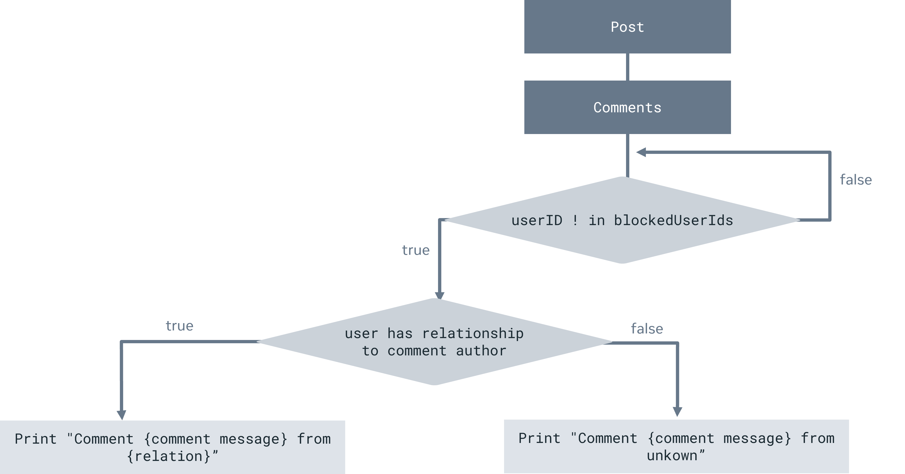

# Exercise: Practice using collections

## Overview

In this exercise, you will practice creating a list, a set and a map, iterating over a list, checking if a set contains an element and finding a value by a key in a map.

## Scenario

Imagine you are creating a forum for coders in a programming community. In that forum, the user can create a post, For instance, they may talk in their post about their code or projects. Other coders in that forum can choose a comment to add to that post. In addition, the users can choose a relationship type. This indicates the relationship between one user and another. These are relationship types such as ‘work colleague’, ‘friend’ or being a member of the same sports team. Finally, you will include the ability for the author of a post to block other users from commenting on the post.

**********Note:********** *******************************************In this exercise, we work with an example that only has one post. It is posted by the current user (post owner). If this were a full real-word application, we would also create a relationship between comments, post owner, or even build a******************************************* `Post` ********************************************************************class. But for this exercise, you don’t need to do any of that.********************************************************************

When all the code is built your output will look something like this:

This is a summary of your tasks in this exercise:

1. Store and display comments
2. Store the user’s relationship to other users
3. Filter out comments of blocked users

********Tip:******** *******************************The map will store the relationships between users.*******************************

The logic of your work in this exercise is shown in the diagram below.



## Instructions

It is recommended that you use the IntelliJ IDE to complete this project. In IntelliJ, Select ********File********, ******New******, **************Project**************. Then in the side panel, select **********************New Project**********************. Finally, ****Name**** the new project and optionally change its save ********location********.

### Step 1: Prepare to store a comment and an author

Create a class called `Comment` and pass two parameters, `userId` of data type Int and `message` of the data type String. The `Comment` class is used to store one comment. In the next step, you will use a list to accumulate all the comments collected by the Comment class. The comments are added by authors to a post.

It should look like this:

```kotlin
class Comment(
		val userId: Int,
		val message: String
)
```

### Step 2: Store all the comments

Here you will create a list of comments. The post may have no comments or many comments. The post may have from 0 to $N$ comments, which means that you will make provision that a post can have from zero to any number of comments. To do this you need to create a list of comments (the list is made up of instances of the class `Comment`). The comment class stores the comments  to a post. In Kotlin, you can store elements by using `listOf()`. Such a list will store elements in a specified order and provide indexed access to them.

With the following values, create a list and store it in a variable named `comments`. It should be of the type `List<Comment>`. As mentioned, the `Comment` class needs two arguments, `userId` and `message`. The `userId` specifies the author who writes the comment, and the content of comment will be defined as `message`.

**********Note:********** *************************The comment can only store text.*************************

| header | Message              |
|--------|----------------------|
| 5241   | Nice code            |
| 6624   | Like it              |
| 5224   | What’s going on?     |
| 9001   | Check out my website |
| 8818   | Hello everyone, 🙂   |

### Step 3: Create a set of blocked user ids

As mentioned in the scenario, a user can block others. To allow for this you need to create as set of blocked users. They will be identified by their `userId`. For this step, you need to use a set, which is another type of collection. In Kotlin a set does not support duplicate elements. When you need to compile something like a list of blocked users then it does not make sense to have any user include in the list more than once.

Create a set of blocked user ids by using `setOf()` with the values 5524 and 9001 and store it in a variable named `blockedUserIds`. It should be of the `Set<Int>`.

### Step 4: Create a map of user relationships

You need to create the relationship between the user and the authors of comments. For this, you need to use a map. In Kotlin a map is a collection that holds pairs of objects (keys and values) and supports efficient retrieval of the value corresponding to each key. Map keys are unique, and that is the reason you need to use a map in this scenario. You’ll be retrieving the values by using a key. The key is `userId` and the value is the relationship type.

Create a map of relationships between user ids and the current user by using `mapOf()` and store it in a variable named `userIdToRelation`. It should be of type `Map<Int, String>` as the user ID is defined as int in the `Comment` class and the relationship type is string.

| User ID | Relationship Type |
|---------|-------------------|
| 5241    | Friend            |
| 6624    | Work Colleague    |

### Step 5: Filter and display comments

Next, you need to display the comments in the forum, but you need to check if the author that comments is blocked or not. By using an if statement, check if the `userId` ****is not in the set of `blockedUserIds`. You defined this in step 3. You first need to iterate over the `comments` list (that you created in step 2) by using a for loop. Inside this loop, use the if  statement to check that the `userId` of the current comment is not blocked (not in `blockedUserIds` variable).

### Step 6: Find the relationships

So far, you can display the comments that you are sure are not blocked by the current user. Now you need to find and display the relationship between the current user and the author of the comment.

Within the if statement in step 5, find the relationship between the current user and the author of the comment. By using an if-else statement, you can find whether the current user has a relationship with the author of a comment. Compare `userIdToRelation` for the `userId` of the current comment. In the case where they do have a relationship, you will retrieve the value inside `UserIdToRelation` map. Otherwise, you will use `unknown`.

### Step 7: Print the comment

Display the comment in the format `Comment {comment message} from {relation}` by passing the formatted string to the `println()` method. 
Your output should be similar to:

```
Comment: {Message} from {RelationType}
```

### Step 8: Run your code

Run your program and write down the output.

**Tip:**

- *You can check if an element is not in a set by using the* `!in` *operator.*
- *You can find a value by the key in a map by using box brackets. For example* `mymap[key]`.

## **Concluding thoughts**

In this exercise, you practiced creating a list, a set and a map, iterating over a list, checking if a set contains an element and finding a value by a key in a map.