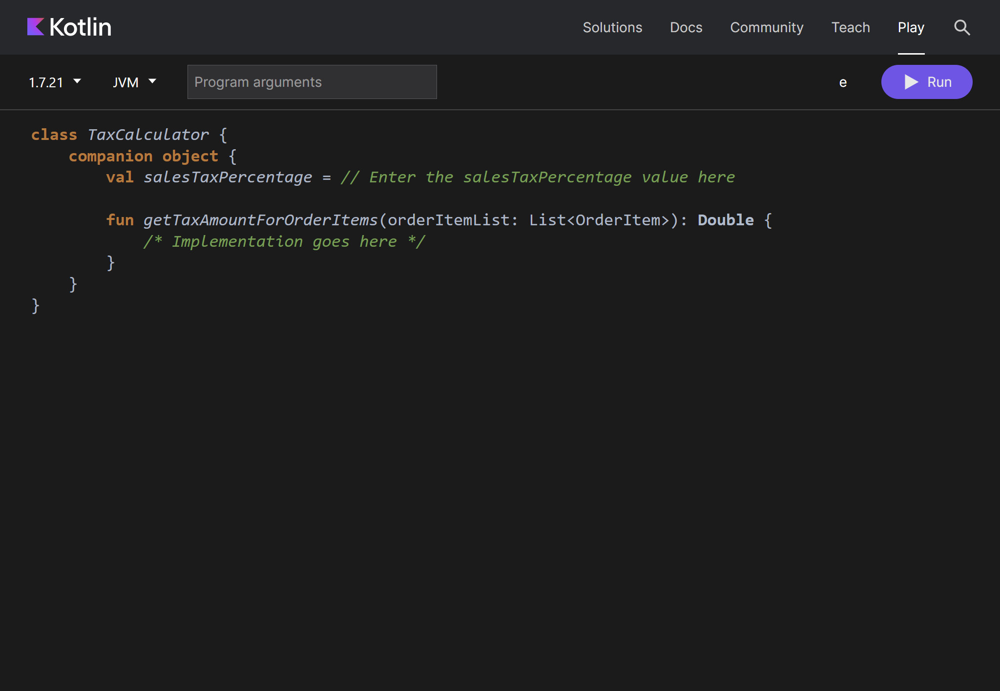

# Exercise: Practice using companion objects

## Overview
Previously you explored the idea behind companion objects in Kotlin and discovered how to define them. 
In this exercise, you will practice how to define and use companion objects in real-life scenarios.

## Scenario
Let’s say that the app for the Little Lemon restaurant needs to calculate the sales tax on a given order amount
and calculate the net order amount before prompting the customer to make the payment for the order.
In this exercise, you’ll develop this tax calculation functionality.

## Definition of key topic
To practice using companion objects, you will define two classes,
`OrderItem` which represents a food item that a customer can order,
and `TaxCalculator` which helps with calculating the tax for a given list of `OrderItem`.
Values such as sales tax percentage are independent of an instance of an order and as a result,
can be defined within the companion object of the `TaxCalculator` class.

## Instructions

### Step 1: Define a data class for the order item
Start by defining a data class `OrderItem` with fields - `name` (string) and `price` (double).

At this point, your screen will look similar to this illustration.

### Step2: Define the class for the tax calculator and its companion object
You will define a companion object in the `TaxCalculator` class which will contain:

1. A `double` variable `salesTaxPercentage` with a value of 15.0 that represents the sales tax percentage
2. A method `getTaxAmountForOrderItems` that takes in a list of `OrderItem` as a parameter
   and returns the amount of sales tax on those items.

### Step 3: Define the function body to calculate the tax amount
Firstly, define a `double` variable named `orderAmount` that will be used to store the total order amount. 
Initialize it with a value of 0.00. 
Then use a for loop to iterate over the list of `OrdeItem` 
and add each item’s price to the `orderAmount` variable. 
Then, return the tax amount by multiplying the tax percentage with the `orderAmount`.
Don't forget to divide by 100.00.

### Step 4: Run the program using a sample list
Define a function main and create a sample list of `OrderItem` with the following items:

| Name   | Price |
|--------|-------|
| Burger | $8.00 |
| Fries  | $4.00 |
| Soda   | $2.00 |

Then, call the function `getTaxAmountForOrderItems` defined in the companion object of the `TaxCalculator`. 
Print the amount of sales tax calculated.

If you completed this exercise correctly, the output should be 2.1.

## Conclusion
By completing this exercise, you have demonstrated your ability to define and use companion objects in Kotlin.
This is important as companion objects are used extensively in Kotlin
to represent values that are not related to any particular object of a class.