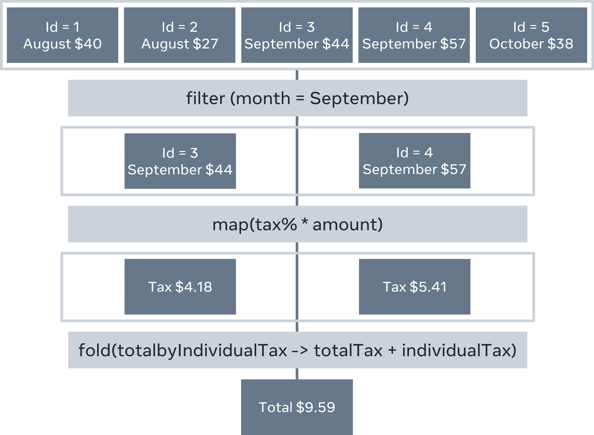

# Exercise: Process collections

## Overview
In this course, you have discovered what collection processing functions are 
and have also examined examples of collection processing functions. 
In this exercise, you will practice a few operations on collections using `map`, `filter`, and `fold` functions.

## Scenario
While working for the Little Lemon restaurant, you want to analyze the sales history of a given month
and calculate the total sales tax collected in that month.
You need to write code using `map`, `filter` and `fold` functions to do this,
and you will use a list of `Order` class defined as:
```kotlin
data class Order(
    val orderId: Int,
    val month: String,
    val amount: Int
)
```

## Definition of key topic
To calculate the sales tax collected for a given month, 
you will use the following collection processing functions:
1. `Map` - Used to transform each element in a collection using a specified logic.
2. `Filter` - Used to filter a set of elements based on Boolean logic.
3. `Fold` - Used to accumulate value starting with an initial value 
   and applying an operation to the current accumulator value on each element, left to right.

## Instructions

### Step 1: Create a sample order list
Firstly, create a sample order list in the function `main` that will contain orders for several months.

For example:
```kotlin
val orderList = listOf(
		Order(1, "August", 40),
		Order(2, "August", 27),
		Order(3, "September", 44),
		Order(4, "September", 57),
		Order(5, "October", 38),
)
```

### Step 2: Filter orders for a particular month
To process a list of `Order` objects that will contain orders of several months,
firstly, you need to use the `filter` function on the `orderList` collection 
to filter the orders that were placed in a particular month. 
For this example, you can use September.

### Step 3: Use Map to transform order to the sales tax amount
Then, to calculate the sales tax amount for each order, you will use the `map` function
to transform each `Order` object to its equivalent sales tax amount 
by multiplying the sales tax percentage by the order amount. 
Let’s say the sales tax is 9.5%,

### Step 4: Use fold to calculate the aggregated sales tax amount
Finally, to get the aggregated sales tax amount for the given month,
you will use the `fold` function and specify logic to add the sales tax amount values of individual orders.
Note that you need to pass the initial accumulator value to the fold function, 
and since you simply need to add the order’s sales tax amount, 
the initial value will be 0.0.

You will then store the return value of this function in a variable `aggregateSalesTaxForSeptember` to print it later.

Flow diagram:


## Conclusion
In this activity, you practiced using collection processing functions such as `map`, `filter`, and `fold`. 
These operations are often used while working with collections in code
and will help you form a foundation for using other standard or user-defined collection processing functions.